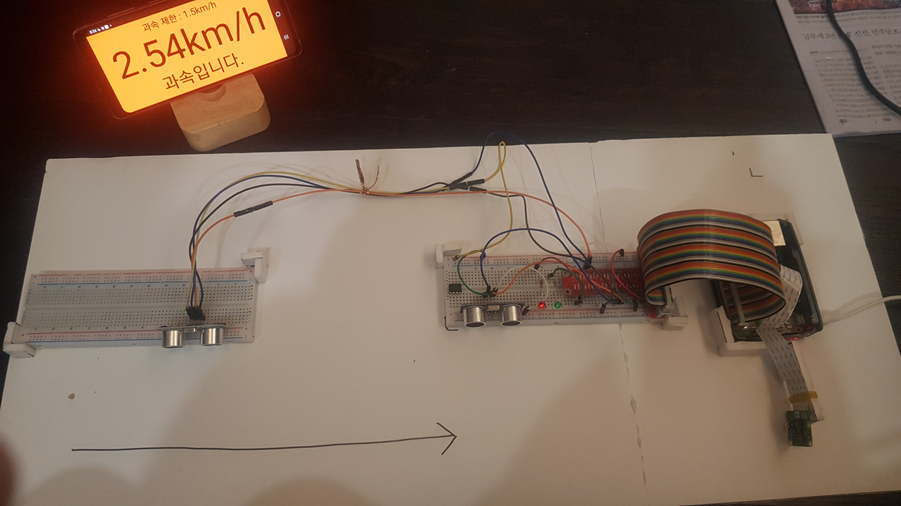
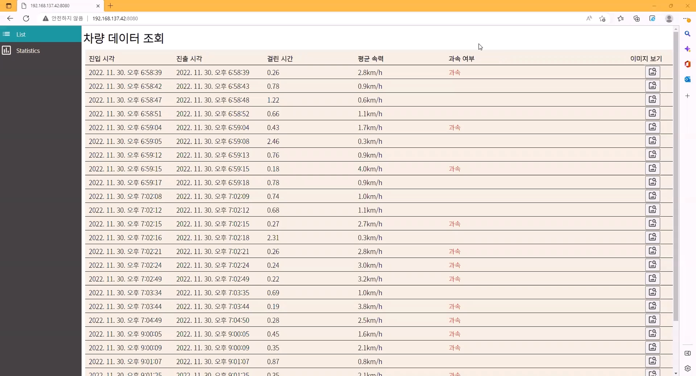
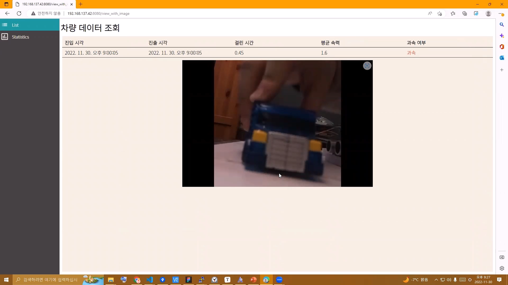
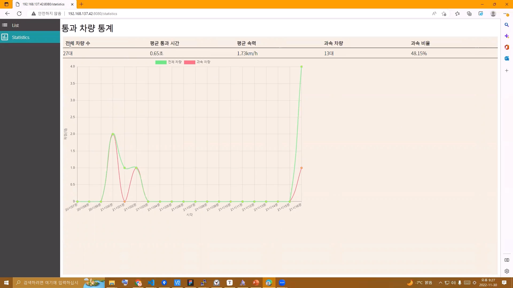
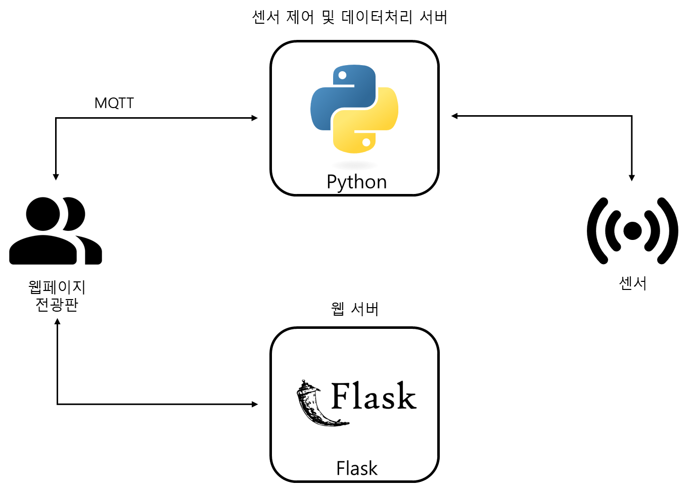

# 초음파 센서를 이용한 과속 단속 시스템

> 2022.10. - 2022.12.
>
> 개인프로젝트

## 🛠 Skills

- Web(HTML, CSS, JavaScript)
- Python , Flask
- MQTT

## 🚗 프로젝트 개요

> 라즈베리파이와 초음파 센서를 이용한 과속 단속 시스템 입니다. 두 개의 초음파 센서에 감지되는 시간 간격을 통해 지나가는 차량의 속도를 측정합니다.  
>
> 카메라 및 센서류로부터 수집된 데이터를 분석하여 처리하는 서버 프로그램부터, 이를 사용해서 사용자에게 서비스를 제공하는 웹서버와 웹사이트까지 포함된 종합적인 서비스입니다.

 

## 💡 기능 및 특징

- 지나가는 차량의 속도 측정
- 통과한 차량의 사진 촬영
- 차량의 과속 여부에 따라 LED 점등
- 차량에 대한 데이터 저장(관측 시간, 속도, 사진 등)
- 웹을 통한 과속 차량 데이터 조회
- 전광판을 이용해 지나가는 차량의 속도를 실시간으로 표시

## ⚙ 시스템 구성도

## 🚗 시연

<video src="../../../../../Download/6.mp4"></video>

